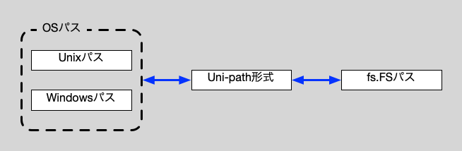

[l4go/osfs]: https://github.com/l4go/osfs

# l4go/unifs ライブラリ

fs.FSを、Unix-likeなパスで操作するためのライブラリです。  
Unix-likeなパスなUni-path形式を定義し、このUni-path形式でのfs.FSの操作を提供します。  
Uni-path形式については、後記します。

以下のような、Uni-path形式との相互変換も必要なので、その機能も提供します 

## fs.FSパスの問題

fs.FSパスには以下のような特徴があります。
(詳細は、[fs.ValidPath()](https://pkg.go.dev/io/fs#ValidPath)の仕様を参照)

- ルートディレクトリは、`.`で表現する。
- パスの区切りは`/`を使う。
- 末尾や先頭の`/`を許さない。

このように、独自かつ厳密な仕様になっているので、良い面もありますが、
OSパスとは互換性がないので、アプリからは利用しにくい側面があります。

## Uni-path形式

Uni-path形式は、`/`区切りの必ず`/`で始まるUnix-likeな絶対パスです。  
特徴的なのが、Windowsのパスも`/`から始まるように変換する点です。

具体的に、WindowsとUnix系OSのパスについて、相互変換の例をいくつか挙げると、以下のようになります。

| Windowsパス | Uni-path | fs.FSパス |
| :-- | :-- | :--|
| (全ドライブ) | / | . |
| C:\ | /C:/ | C: |
| C:\User\foo\ | /C:/User/foo/ | C:/User/foo |
| C:\User\foo\bar | /C:/User/foo/ | C:/User/foo |

| Unix系OSのパス | Uni-path | fs.FSパス |
| :-- | :-- | :--|
| / | / | . |
| /home/foo/bar | /home/foo/bar | home/foo/bar |
| /home/foo/ | /home/foo/ | home/foo |

Uni-path形式上では、
Windowsのドライブは、ルートディレクトリのサブディレクトリとして扱われ、
ルートの`/`が全ドライブをもつ、ディレクトリとして扱われます。

Uni-path形式であれば、Windowsのドライブ名を特別扱いする必要がなくなるので、
fs.FSとしてドライブ名も扱えるようになるわけです。

## Uni-path形式のメリット

Uni-path形式は、 入力段階で、すべてのファイルパスをUni-path形式に変換して、
プログラム内のパスをUni-path形式に統一することを前提にしています。  
これは、プログラム内のパスをUni-path形式に統一すると、
以下のようなメリットが生まれるからです。

- OSパスに依存したコードをアプリから削減できる。
    - OSパス依存の処理をこのunifsライブラリーに丸投げできる。
- Uni-pathへの変換は事前に行われるので、fs.FSパスとしての間違いは、実行前に知ることができる。
    - パス変換エラーを、処理前に(早く)知ることが出来る(無駄な待ち時間が減らせる)。
    - 処理中断による被害(データ破損など)を減らせる。
    - 処理中のパス変換エラー処理を簡略化できる。
- fs.FS実(OS)のファイルパスに近い。
    - ルートディレクトリを`/`と記述できる。
        - 利用者にルートディレクトリを`.`と記述させるのは優しくない。　
    - `/`の冗長な重複を許容する。 

## OSファイルシステム用fs.FS

汎用性を考慮して、OSファイルシステム用fs.FSは、[l4go/osfs]として実装を分離しています。  
OSファイルシステムへのアクセスが必要な場合は、[l4go/osfs]を併用してください。

[l4go/osfs]は、Uni-path形式`/`に対応していますので、
`os.DirFS("/")`相当のことが、Windowsでも実現します。

## unifsの機能詳細

このライブラリーの詳細な仕様は、下記を参照してください。

- [Uni-path形式stringとの変換関数](path.md)
    - string型のOSパス、fs.FSパス、Uni-Path形式のパスを、相互変換するための関数群です。
- [UniPath型](unipath.md)
    - Uni-path形式をカプセル化するUniPath型を提供します。(string流用での変換漏れ防止に利用)
- [Uni-path形式のための、fs.FS機能ラッパー関数](wrap.md)
    - fs.FSの機能をUni-pathで楽に呼び出す為のラッパー関数群
